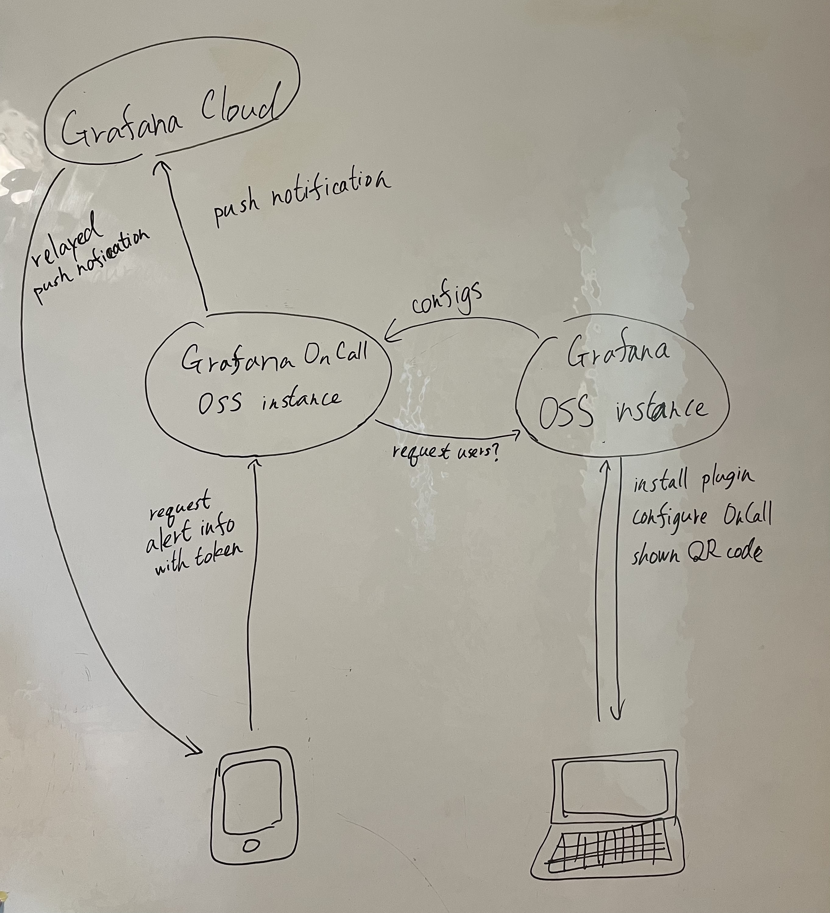

- Grafana OnCall OSS instance
  - has configurations for OnCall features
    - configured from OnCall plugin installed on Grafana OSS instance
  - has two endpoints:
    - an internal endpoint for Grafana OSS instance
    - an global endpoint accessed from OnCall mobile application
  - has a token for OnCall API of Grafana Cloud
    - it is used to push notification
    - Grafana Cloud relay the notification to OnCall mobile application
  - knows the internal endpoint of Grafana OSS instance via environment variable `GRAFANA_API_URL`
  - provides any OnCall features to OnCall mobile application
- Grafana OSS instance
  - installing OnCall plugin
    - has GUI to configure OnCall
    - knows the internal endpoint of Grafana OnCall OSS instance via plugin initial configuration
    - shows QR code for OnCall mobile application to scan
      - it includes the global endpoint of Grafana OnCall OSS instance and the token

